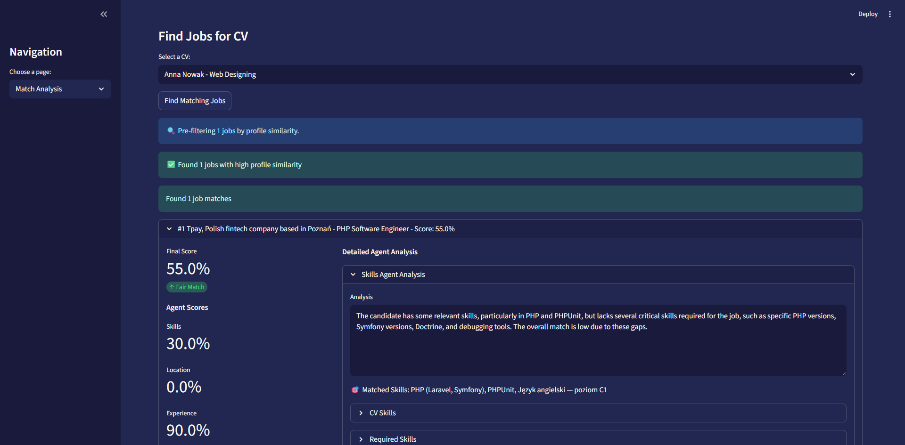

# 

**AI-powered CV and job posting matching using multi-agent analysis**

Skillo is an intelligent application that uses artificial intelligence to match CVs with job postings through a sophisticated multi-agent system. The application analyzes location compatibility, skills match, experience levels, work preferences, and semantic similarity to provide comprehensive matching scores.


## 🚀 Features

### Core Functionality
- **📄 Document Upload**: Upload PDF CVs and job postings through intuitive interface
- **🤖 Multi-Agent Analysis**: 6 specialized AI agents analyze different aspects of matching
- **📊 Comprehensive Scoring**: Weighted scoring system with detailed explanations
- **🔍 Bidirectional Matching**: Find jobs for CVs or candidates for jobs
- **📈 Match Insights**: Detailed breakdown of strengths and weaknesses

### AI Agent System

#### Document Processing
- **📄 CV Processing Agent** - Extracts candidate information and metadata
- **📋 Job Processing Agent** - Extracts job requirements and metadata  
- **🤖 Profile Classification** - ML model determines candidate profiles (e.g., "Software Developer", "Data Scientist")

#### Match Analysis
The application uses 6 specialized agents coordinated by a supervisor:

1. **🌍 Location Agent** - Geographic matching and remote work analysis
2. **💪 Skills Agent** - Technical and soft skills comparison  
3. **📈 Experience Agent** - Years and industry experience relevance
4. **❤️ Preferences Agent** - Work style and culture fit
5. **🎓 Education Agent** - Academic background and certification matching
6. **👔 Supervisor Agent** - Coordinates agents and produces final scores

### Management Features
- **📚 Document Management**: View, organize, and manage uploaded documents
- **📊 Database Statistics**: Track document counts and database health
- **🗑️ Database Reset**: Clean database with confirmation workflow
- **📥 Export Data**: Export documents in CSV format
- **💾 Vector Storage**: Persistent ChromaDB storage for embeddings

## 🛠 Technology Stack

- **Architecture**: Clean Architecture + Domain-Driven Design (DDD)
- **Frontend**: Streamlit (Web UI)
- **AI/ML**: OpenAI GPT & Embeddings, LangChain
- **Vector Database**: ChromaDB
- **Document Processing**: PyMuPDF
- **Data Processing**: pandas, numpy
- **Dependency Injection**: DI with dependency-injector library
- **Deployment**: Docker, docker-compose, Poetry

## 📋 Prerequisites

- Python 3.13+
- Poetry (for dependency management)
- Docker & Docker Compose (for containerized deployment)
- OpenAI API key

## 🚀 Quick Start

### Option 1: Docker (Recommended)

```bash
# 1. Clone the repository
git clone https://github.com/mdepczyk/skillo.git
cd skillo

# 2. Setup environment
cp .env.example .env
# Edit .env file and add your OPENAI_API_KEY

# 3. Start the application
docker-compose up --build

# 4. Access the application
# Open http://localhost:8501 in your browser
```

### Option 2: Local Development

```bash
# 1. Clone the repository
git clone https://github.com/mdepczyk/skillo.git
cd skillo

# 2. Install Poetry (if not installed)
curl -sSL https://install.python-poetry.org | python3 -

# 3. Install dependencies
poetry install

# 4. Setup environment
cp .env.example .env
# Edit .env file and add your OPENAI_API_KEY

# 5. Run the application
poetry run streamlit run skillo/ui/app.py
# Or using module entry point:
poetry run python -m skillo

# 6. Access the application
# Open http://localhost:8501 in your browser
```

## 🎮 Usage Guide

### 1. Upload Documents
- Navigate to **"Upload Documents"** page
- Upload PDF files for CVs and job postings
- Wait for processing and vector embedding generation

### 2. Browse Documents
- **"CV List"** page: Browse all uploaded CVs with candidate profiles, skills preview, and PDF viewer
- **"Job List"** page: Browse all uploaded job postings with company information and position details
- Preview documents directly in the browser
- View extracted candidate/company information

### 3. Perform Matching Analysis
- Go to **"Match Analysis"** page
- Choose analysis type:
  - **Find jobs for a CV**: Select a CV to find matching job postings
  - **Find candidates for a job**: Select a job to find matching CVs
- View detailed match results with scores and explanations

### 4. Manage Documents
- Visit **"Document Management"** page
- View all uploaded documents
- Export data in CSV or JSON format
- Reset database when needed

### 5. Monitor Database
- Check **"Database Statistics"** page
- View document counts and distribution
- Monitor database health

## 📊 Match Analysis Details

### Scoring System
Each match receives a final score (0-100%) based on weighted contributions from all agents:

- **Location** (15%): Geographic compatibility and remote work options
- **Skills** (30%): Technical and soft skills alignment
- **Experience** (25%): Years of experience and seniority level match
- **Preferences** (10%): Work style and cultural fit
- **Education** (20%): Academic background and certification alignment

### Match Results Include:
- **Overall Score**: Weighted final score with performance category
- **Agent Breakdown**: Individual scores from each specialized agent
- **Detailed Insights**: Explanations for each matching dimension
- **Strengths/Weaknesses**: Identification of best and worst matching areas

## 🔧 Configuration

### Environment Variables

Create a `.env` file based on `.env.example`:

```bash
# OpenAI Configuration
OPENAI_API_KEY=your_openai_api_key_here

# Vector Database Configuration  
CHROMA_DB_PATH=./chroma_db

# Prompts Directory
PROMPTS_DIR=./skillo/infrastructure/prompts

# Agent Weights (must sum to 1.0)
LOCATION_WEIGHT=0.15
SKILLS_WEIGHT=0.30
EXPERIENCE_WEIGHT=0.25
PREFERENCES_WEIGHT=0.10
EDUCATION_WEIGHT=0.20
```

### Customization

You can adjust the agent weights in `.env` to prioritize different aspects of matching based on your requirements. All weights must sum to 1.0.

## 🐳 Docker Deployment

```bash
# Start services
docker-compose up --build

# Run in background
docker-compose up -d

# View logs
docker-compose logs -f

# Stop services
docker-compose down
```

## 🧪 Development

### Development Tools
```bash
# Install with dev dependencies
poetry install

# Run tests
make test

# Format code
make format

# Run linting
make lint

# Development mode with auto-reload
make dev
```

### Project Structure

```
skillo/
├── docker-compose.yml          # Docker services configuration
├── Dockerfile                  # Container build instructions  
├── pyproject.toml              # Poetry dependency management
├── data/                       # Document storage
├── samples/                    # Sample PDF files (CVs and job postings)
├── chroma_db/                  # ChromaDB vector database storage
├── tests/                      # Minimal pytest test suite
└── skillo/                     # Main application package
    ├── main.py                 # Composition root
    ├── domain/                 # Business logic
    │   ├── entities/           # Core business entities
    │   ├── events/             # Domain event system
    │   ├── services/           # Domain services
    │   └── repositories.py     # Data access interfaces
    ├── application/            # Use cases and workflows
    │   ├── facades/            # Application facades
    │   ├── use_cases/          # Business workflows
    │   ├── protocols.py        # Service contracts
    │   └── dto.py             # Data transfer objects
    ├── infrastructure/         # External integrations
    │   ├── agents/             # AI agents (LangChain)
    │   ├── config/             # Configuration management
    │   ├── processing/         # Document processors
    │   └── repositories/       # Data implementations
    └── ui/                     # User interface (Streamlit)
        ├── components/         # Reusable UI components
        └── views/              # Page views
```

## 📸 Screenshots



*The Skillo application interface showing the CV matching results with detailed scoring breakdown from all AI agents including location, skills, experience, preferences, and semantic analysis.*

